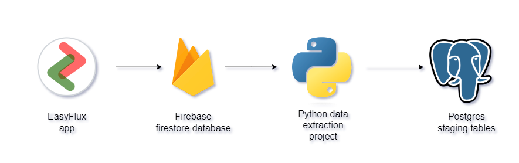
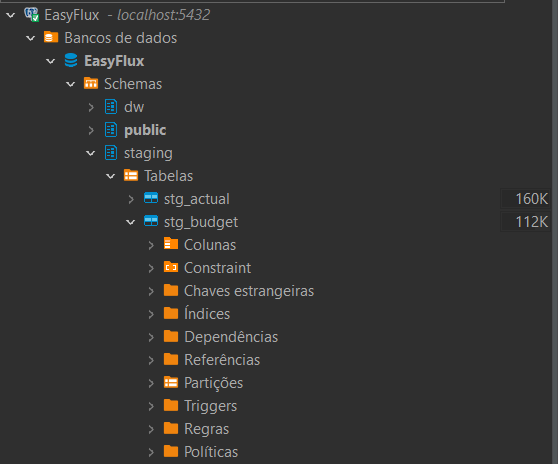

# Python project EasyFlux data extraction

### This is a data extraction project that uses Python as the main tool to obtain data from a Firebase database, process it and insert it into a Postgres database.
&nbsp;
 
## Description

#### This project is for personal use only. As this is financial data entered into the EasyFlux application, this project is dedicated only to extracting input and output entries for a specific user. This data is processed and inserted into staging tables in Postgres solely for the purpose of highlighting the potential of Python and its libraries in terms of extracting, processing and loading data.
#### For this reason, this project does not have a table of contents or installation guide. Here I only detail the transformation steps and the final results.
&nbsp;

&nbsp;

## Objective

#### The objective of this project is to work with the resources provided by the Firebase library for Python and extract the data from the EasyFlux application to load into the Postgres database where a data warehouse project with Pentaho will later be used to create Fact tables. Finally, the data can be used in a Power BI project.
&nbsp;

## Data transformation steps

#### Here are some details about data transformation in the project.
&nbsp;

### Firebase layer

#### In the layer dedicated to collecting data from the Firestore database, the Firebase_admin library is used. It is today the most efficient and recommended by Firebase itself for data processing.
#### Here we can see the function that searches the Firebase data collection and starts processing the data by adding it to a list of dictionaries.

```python 
def get_collection(self, collection: str) -> list:
        """Returns a list of entries retrieved from firestore database.

        Args:
            collection:str 

        Returns:
            list 
        """
        doc_list = []       
      
        docs = (
          self.db.collection(collection).stream()
        )         
        
        for item in docs:
            item_data = {}          
            item_data['id'] = item.id            
            item_data['date'] = item._data['date'].strftime("%m/%d/%Y, %H:%M:%S")    
            item_data['entryType'] = item._data['entryType']  
            item_data['category'] = item._data['category']  
            item_data['type'] = item._data['type']  
            item_data['period'] = item._data['period']   
            item_data['description'] = item._data['name']
            item_data['amount'] = item._data['amount']           
            doc_list.append(item_data)
        
        return doc_list       
```
&nbsp;

### Postgres layer

#### This layer is responsible for dividing the dataframes into data relating to budgets and actuals. It is also at this layer that the connection to the Postgres database is created and the engine is established to send data.

```python 
def create_engine(self, table:str, df:pd.DataFrame) -> int | None:
        """ Create the engine to connect to Postgres database and insert the dataframe lines

        Args:
            df (pd.DataFrame)

        Returns:
            int | None: Number os rows affected
        """                 
        engine = create_engine(
          f'postgresql+psycopg2://{self.user}:{self.password}@{self.host}:{self.port}/{self.database}',
            connect_args={'options': '-csearch_path={}'.format(self.schema)}
        )        
        try:
            result = df.to_sql(table, engine, if_exists='replace')
            return result
        except ValueError:
            raise "Cannot insert into {}".format(table)
```
&nbsp;

## Postgres staging tables

#### The tables resulting from this process are two staging tables referring to entries defined as budget and actuals.

&nbsp;

## Next steps

### The next step will be to continue this project with the development of a pipeline with Pentaho to generate fact tables for the data warehouse. The tables resulting from this process will be used in another Power BI project to analyze financial data.
&nbsp;

## Author
- Tiago Bratz Heck
##### Access my [LinkedIn](https://www.linkedin.com/in/tiago-bratz-heck-0b9b5696/) profile.